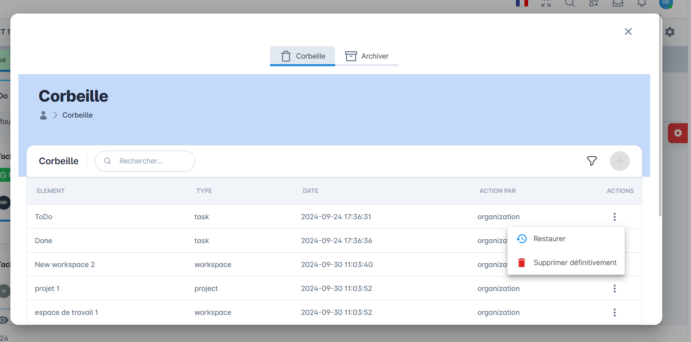

# Worcal - Project Overview

## 📝 Project Description
**Worcal** is a collaborative task management platform designed to streamline team workflows. It allows teams to manage tasks, communicate effectively, and track progress in real-time. This repository provides an overview of my contributions to the project, including screenshots and descriptions of the features I worked on.

---

## 🛠️ My Contributions
As part of the development team, I contributed to the following areas:

- **Authentication System:** Implemented JWT-based authentication for secure user login.
- **Task Management:** Built a system for creating, assigning, and tracking tasks for team members.
- **Messaging System:** Developed a mailbox feature for team members to communicate with each other.
- **Tracking System:** Created a tracking system to monitor user activities within their teams.
- **Trash Management:** Implemented a trash system for archiving, deleting, and restoring tasks.
- **User Management:** Built a user management system to update and modify user information.

---

## 🖼️ Screenshots

### 1. GitKraken & GitLab Commits
  
*Description: All my commits were managed using **GitKraken** and pushed to **GitLab**. This screenshot shows my workflow and version control process.*

---

### 2. Login Page with JWT Authentication
  
*Description: I implemented a secure login system using **JWT (JSON Web Tokens)** for authentication. This ensures that only authorized users can access the platform.*

---

### 3. Mailbox for Team Communication
  
*Description: I developed a mailbox feature where team members can send and receive messages. This enhances communication and collaboration within teams.*

---

### 4. Task Management System
  
*Description: I built a task management system where tasks can be assigned to team members. Each task can have a **responsible member** and a **helper** to ensure smooth collaboration.*

---

### 5. Activity Tracking System
  
*Description: I created a tracking system to monitor all activities performed by team members. This helps in keeping track of progress and ensuring accountability.*

---

### 6. Trash Management System
  
*Description: I implemented a trash system similar to a computer's recycle bin. Tasks can be **deleted**, **archived**, or **restored** as needed.*

---

### 7. User Management System
  
*Description: I developed a user management system where administrators can **update user information**, **change roles**, and **modify permissions**.*

---

## 🛠️ Technologies Used
- **Frontend:** Angular, HTML5, CSS3, TypeScript
- **Backend:** Java, Spring Boot, REST APIs
- **Authentication:** JWT, Spring Security
- **Database:** PostgreSQL
- **Version Control:** Git, GitKraken, GitLab
- **DevOps:** Jenkins, Docker

---

## 📜 License
This repository is for demonstration purposes only. The screenshots and descriptions are shared with permission from the project owner.

---

## 🙌 Acknowledgments
- Special thanks to the **Worcal team** for the opportunity to contribute to this project.
- Thanks to my mentors and colleagues for their support and collaboration.

---

## 📧 Contact Me
If you have any questions or would like to discuss my contributions further, feel free to reach out:  
- **Email:** morarhib@gmail.com 
- **LinkedIn:** https://www.linkedin.com/in/rarhibmouad/
- **GitHub:** https://github.com/mouadrarhib
